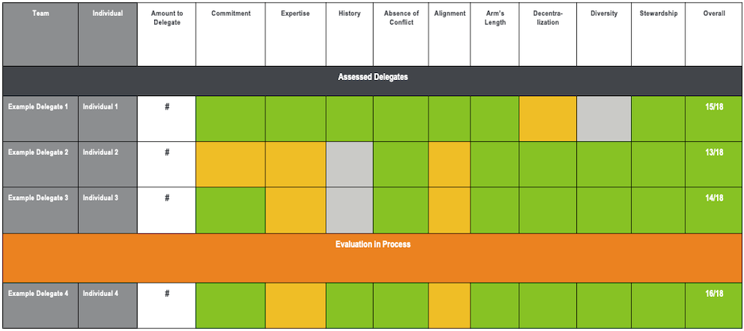

# Template Delegation Rubric 

&nbsp;

###  \[DELEGATE NAME\]

&nbsp;

#### **Score**

| Total               | \_\_/18 |
|---------------------|---------|
| Commitment          | \_\_/2  |
| Expertise           | \_\_/2  |
| History             | \_\_/2  |
| Absence of Conflict | \_\_/2  |
| Alignment           | \_\_/2  |
| Arm’s Length        | \_\_/2  |
| Decentralization    | \_\_/2  |
| Diversity           | \_\_/2  |
| Stewardship         | \_\_/2  |

&nbsp;

#### **Background Information:**

\[Here, we provide a brief summary of the proposed delegate, including
their background, location, expertise, and historical participation in
this or other communities.\]

**Date of Assessment**: \[DATE\]

**What is their process for tracking developments on the Protocol?**:

-   \[Here, we identify what their process is for staying on top of new
    developments in the ecosystem (including up and coming proposals)\]

**What is their decision making process?**

-   \[Here, we outline their internal decision making process\]

**What is their vote execution process?**

-   \[Here, we outline their technical process for executing votes,
    introducing proposals, etc.\]

**What is their approach towards community engagement?**

-   \[Here we outline their approach towards engaging with the
    community, including discussing their thought process on proposals
    and votes on Twitter, Discord, governance forums, community calls
    etc.\]

#### **Detailed Assessment:**

1.  **Protocol Commitment**

    -  What is their level of commitment to Protocol and its
        governance?

        -  (+2 pts) This directly relates to their core work or
            responsibilities.

        -  (+1 pts) This is a demonstrated personal interest or is
            parallel to their core work.

        -  (+0 pts) This is a new potential interest or is potentially
            related to their core work.

2.  **DeFi and Crypto Expertise**

    -  What is their background and how does it qualify them to
        participate?

        -  (+2 pts) Their background is directly related to crypto
            governance, smart contract development, code auditing,
            financial risk modeling, DeFi protocols, or similar; they
            are ideally qualified.

        -  (+1 pts) Their background is indirectly related to the
            above; they have a background in software, cryptography,
            finance; they are generally qualified.

        -  (+0 pts) Their background is unrelated to the core goals and
            challenges of the protocol.

3.  **History re: DeFi engagement**

    -  What is their history in terms of community engagement, and how
        are they generally perceived publicly?

        -  (+2 pts) They have a strong history of transparent and
            articulate community engagement, and are generally perceived
            to be informed, extremely competent, and motivated by more
            than their own self-interest; they embody the ethos of
            stewardship.

        -  (+1 pts) They may have a history of positive community
            engagement, and may be perceived to be informed, competent,
            and selflessly motivated — but this reputation is new,
            developing, or not entirely robust.

        -  (+0 pts) They have no distinct history of community
            engagement and only have potential to develop a strong
            reputation.

4.  **Absence of Conflict with Protocol’s Success**

    -  Do they have any outstanding conflicts of interest with
        Protocol, or any ways they would benefit from Protocol’s
        failure?

        -  (+2 pts) They have no existing conflicts with Protocol, and
            would not benefit in any way from Protocol’s failure.

        -  (+1 pts) They have no outright conflicts with Protocol, but
            may benefit in some unusual circumstances if Protocol fails.

        -  (+0 pts) They have an outright conflict with Protocol, or
            may benefit if Protocol fails.

5.  **Positive Alignment with Protocol’s Success**

    -  Are they positively aligned with the long-term interests of
        Protocol?

        -  (+2 pts) Their current business model or goals mean they
            will benefit directly if Protocol succeeds and grows; their
            success is tied in some way with Protocol’s success.

        -  (+1 pts) They will indirectly benefit if Protocol succeeds
            and grows, but Protocol’s success is not necessary or
            extremely helpful to them.

        -  (+0 pts) Protocol’s success does not meaningfully impact
            them or their business.

6.  **“Arms” Length or Independence from a16z**

    -  Are they at “arm’s length” from us to ensure independent voting
        post delegation?

        -  (+2 pts) They are at “arm’s length”, meaning no formal
            relationship with a16z and a16z has no influence on their
            decision making.

        -  (+0 pts) They could not reasonably be considered at “arm’s
            length”.

7.  **Impact on Decentralization**

    -  Will delegating to this party help further the decentralization
        of governance power in the network?

        -  (+2 pts)  They hold 1% or less of the network’s fully
            diluted voting power  

        -  (+1 pts)  They hold between 1% and 5% of the network’s fully
            diluted voting power  

        -  (+0 pts)  They hold more than 5% of the network’s fully
            diluted voting power

8.  **Diversity**

    -  Will delegating to this party increase the overall diversity of
        perspectives within governance to avoid groupthink?

        -  (+2 pts) They represent a group, profile or perspective that
            is currently underrepresented in governance. 

        -  (+0 pts) They represent a group, profile or perspective that
            is already widely represented in governance.

9.  **Stewardship**

    -  Do they embody the ethos of stewardship and believe in
        Protocol’s underlying mission?

        -  (+2 pts) They are likely to act as good stewards of Protocol
            and will work to further its underlying mission over the
            long term. 

        -  (+0 pts) It is not clear that they will act as good
            stewards, or have a history of engaging in behavior that
            suggests otherwise.
